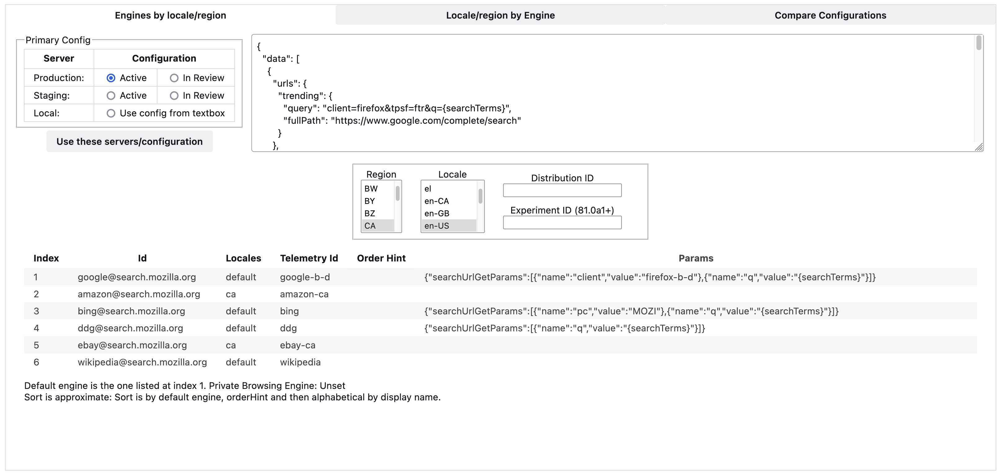

# SearchEngine Devtools

This addon provides some tools to assist developers with
search engine configuration.

# Features

- Change locale and region
- Change configuration



# Install

- Pick the .xpi file from the [releases page](https://github.com/mozilla/searchengine-devtools/releases).
- When asked for comnfirmation, select "Continue to installation".

> Note: it is highly recommended to use a temporary or development user profile

# Development

```
npm install
```

Run in a browser with live-reload:

```
npm start -- --firefox-binary ~/path/to/firefox
```
